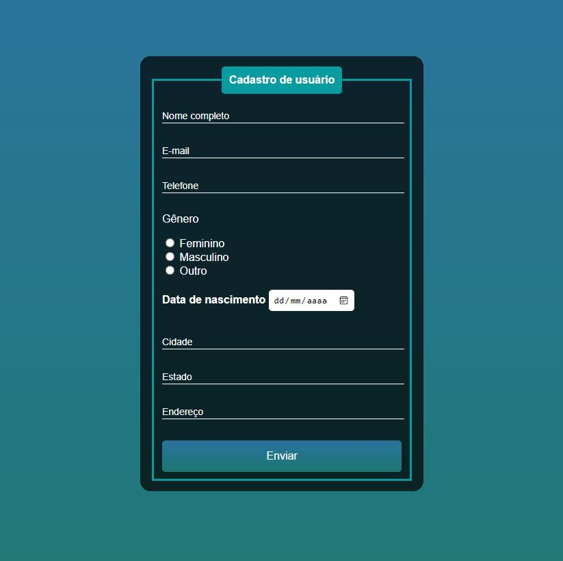

# Formulário

 

## Descrição

Este é um projeto desenvolvido totalmete a nível didático, e que serviu para treinar, aprender e aprimorar conhecimentos de HTML e, principalmente, de CSS. 
Com o desenvolvimento do formulário, passei a conhecer, mesmo que superficialmente, recursos como: animações em CSS, o funcionamento das tags "fieldset" e "legend" e, também, obtive uma melhor noção sobre como as cores influenciam na experiência do usuário - assunto que me interessa e que estou aprendendo mais a respeito.

 

## Projeto Funcionando

 

## Como Rodar a Aplicação
1. Crie uma pasta em seu computador
2. Após abri-la, clique com o botão direito do mouse dentro dela, vá até "novo" e crie dois _Documentos de Texto_
3. Copie o código do arquivo index.html presente em minha **pasta Formulario**, aqui no GitHub
4. Cole o código dentro de um dos documentos de texto criados e renomeie esse arquivo para **index.html**
5. Faça o mesmo para o meu arquivo style.css: copie, cole e renomeie o outro arquivo txt para **style.css**
6. Por fim, abra o seu arquivo index.html - o arquivo deverá abrir, automaticamente, em seu navegador
 

## Tecnologias Utilizadas
 
