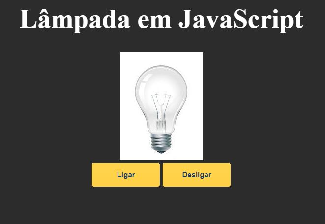

  

 

<h2 align="center">Descrição</h2>

Este projeto trata-se de meu primeiro programa postado no GitHub. E é um dos primeiros que desenvolvi também. Ele consiste em uma lâmpada que acende 
  através de duas ações: clicar em "Ligar" e passar o cursor do mouse sobre sua imagem; ela também apaga de duas maneiras: clicando em "Desligar" e ao retirar o cursor de cima de sua imagem.
  Toda vez que a lâmpada acende ou apaga, a cor do background da página é alterada. Além disso, a lâmpada também quebra, basta dar um duplo clique sobre ela.

 

<h2 align="center">Projeto Funcionando</h2>

    

 

<h2 align="center">Como Rodar a Aplicação</h2>

1. Abra o terminal de seu computador 
2. Navegue até o local onde pretende armazenar o projeto; para isso, use o comando _cd_ 
3. Copie e cole o seguinte comando: git clone https://github.com/Flavioodev/Short-Projects.git 
5. Abra a pasta em que guardou o projeto, vá até _Lampada em JS_ e abra o arquivo _index.html_ 
6. Pronto, agora é só testar!
 

<h2 align="center">Tecnologias Utilizadas</h2>

   

